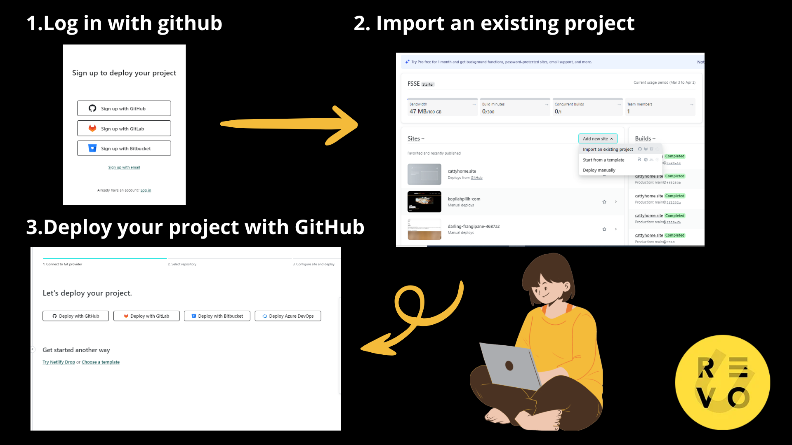
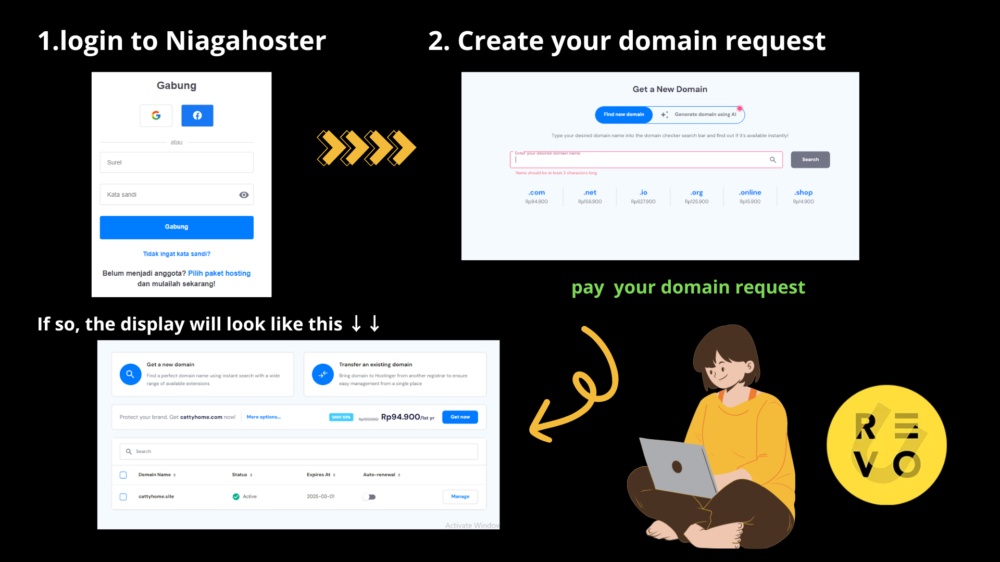

[](https://classroom.github.com/a/NtxSJSoQ)


# HELLO EVERYONE!

Hi, i'm Frisqia Fatmalaningsih. i wanna tell this project. project about companny website. i haven't inspiration so i made company which i worked

## Structured 📋

- Header
  - navbar
  - logo
  - menu
- Section
  - visi & Misi
  - About
  - image product to slideshow
- article
- aside
- form
- footer

## How To set Up ⚙️

first create github account to clone this repository to get main branch

1. clone this repository to your terminal

```
git clone https://github.com/RevoU-FSSE-4/milestone-1-frisqia.git

```

2. create folder/file and start to write your code

3. if done you should push it

```
git add .
git commit -m "your massage"
git push origin main (your branch)
```

## Deployment 🖥️

the project has been successfully deployed using Netlify. You can access my project by following this link: https://cattyhome.site/

### How To Set Up ⚙️

1. connect your account netlify



2. create domain at niagahoster



3. connect your domain request to your website at netlify


congratulation your web is done !
